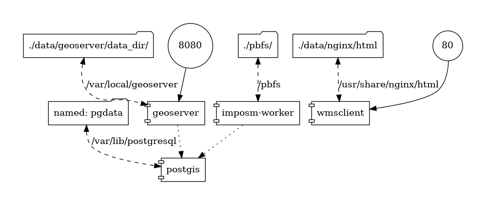

# osm-geoserver-postgis

**Get your preferred OSM dataset (ie. country) running in a local Geoserver instance with only 2 commands.**

<a href="https://www.youtube.com/watch?v=XpFxNAVAy3k" rel="video"></a>

On previous image you can see the demo application in action (at http://localhost we serve a small app that allows to see the content of your deployment)

Project involves a docker-compose.yml file that assembles the necessary components to implement a Geoserver instance that publishes the OpenStreetMap (OSM) layers locally on a single host/machine (Postgis is required to store the OSM layers).

Instructions for this project are based on this repository [OSM-Styles](https://github.com/geosolutions-it/osm-styles), but making a simpler execution plan.

The steps and scripts are intended to run in the context of Linux, Mac and Windows environments

Note that you can browse the OSM Internet version or the OSM Local instance for which only in the region of Suriname you will see details on the high-resolution (you can extent it to global coverage of desired, just you will need to ingest the full global dataset of OSM files). Explanations below.

## Steps

With the scripts that are included in the folder we have simplified the steps to deploy a solution that includes a Geoserver instance publishing the OSM layers (stored in a Postgis), using WMS service.

This simplification will work fine when deployment is done on the same host (on which the docker-compose that initializes the system will be executed). If you have to deploy on more than one host, you have to consider some technical aspects (basically, the same as moving from docker-compose to swarm or kubernetes, so you will have to adapt it).

The idea is to keep the use case simple (below is the diagram of containers and volumes to create).

**Preconditions:**

1. Install [git](https://github.com/git-guides/install-git), [docker](https://docs.docker.com/engine/install/ubuntu/) y [docker-compose](https://docs.docker.com/compose/install/) on the host machine.

2. Download the repository of this project.

   ```
   git clone https://github.com/geotekne-argentina/osm-geoserver-postgis
   ```

3. Optional: edit file setup-datasets.sh and select which file to download (from GeoFabrik, https://download.geofabrik.de/), otherwise default demo will download Suriname PBF file.

**2 Steps**

1. Execute setup-datasets.sh script

   ```
   ./osm-geoserver-postgis/setup-datasets.sh
   ```

2. Once the datasets setup is finished, then execute startup.sh script

   ```
   ./osm-geoserver-postgis/startup.sh
   ```

**IMPORTANT:**
 - ensure that mapped ports (80 and 8080) in your host are available and free to use.
 - remember to run the ./setup-datasets.sh script so you will be downloading the LOW resolution file.

Observations :

- OSM Data reset: Every time the docker-compose is initialized, it is validated if there are files to import in the PBFs folder, and so the information of the OSM layers is reset. Only in the case of having the folder empty, that is to say without PBF files, is that the existing information on the pgdata volume will not be reset. So we suggest to run the ./setup-datasets.sh script at least one time, and then to add your PBFs files in the ./pbfs folder. After first execution of ./start.sh script (that will trigger the import process) we suggest to remove the PBFs files from the ./pbfs folder otherwise the import process will execute every time you start the docker composition)

(*) The initial version of this file comes from this repository https://github.com/geosolutions-it/osm-styles (in the README you will find the link to download it from Dropbox), but it has errors/imperfections in certain areas - product of the treatment to lower the resolution - that have been corrected.


## Technical Details

- One instance of each service
- Images used
  - geoserver: geotekne/geoserver:lime-alpine-2.16.2
    - The docker-compose defines the use of the CSS and Pregeneralized features plugins to render the OSM layers accordingly.
  - postgis: kartoza/postgis:12.1
    - Used to store the OSM layers.
  - wmsclient: nginx:1.21.3-alpine
    - That shows in a simple example, an html+css+js web application, the access to live OSM data or to the OSM in local instance that we have created. Accessible via browser at http://localhost:80
  - imposm-worker: geotekne/imposm-worker:1.0.0
	  + Container that allows to ingest the PBFs files located at ./pbfs folder in the Postgis database
- Geoserver data volume mapped to folder on host
- Postgis data volume mapped to pgdata volume in docker
- Wmsclient data volume mapped to folder containing the sample web application.
- Ports mapped on host:
  - geoserver: 8080
  - postgis: 5432
  - wmsclient:80

## Diagram


